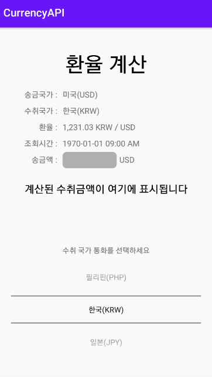

## CurrencyAPI
Currency Layer API를 통해 환율 정보를 가져오는 앱

#### API 정보
- 웹사이트 링크: https://currencylayer.com/
- 해당 웹사이트에서 무료 계정을 생성해 Free Plan 이용
- 부여받은 API Key를 endpoint url에 query pararmeter 값으로 넣어 사용

#### 앱 설명
- API로 가져오는 모든 국가의 통화를 사용하지 않음
- 한국(KRW), 필리핀(PHP), 일본(JPY) 세 국가 환율만 선택하도록 설정함
- Constants.kt에서 통화 추가할 수 있음
- 혹은 currencies에 해당하는 query parameter를 지우면 모든 통화를 받을 수 있음

#### 무료계정 사용 범위 ([링크](https://currencylayer.com/product))
- 무료 계정은 송금국가(source)를 USD로밖에 사용할 수 없음
- 요청 제한: 250 Request / Month
- 업데이트 빈도: Daily(일 1회)
- etc

